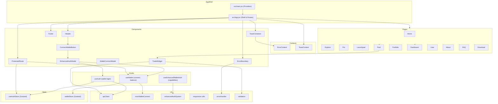
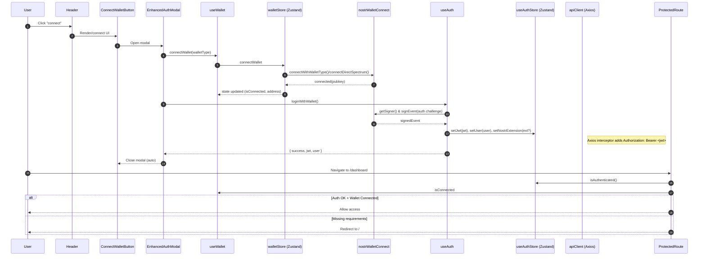

# Postfun Web App — Pages, Styles, and Components PRD

This PRD summarizes the app’s pages, core components, styling system, data/auth flows, and dependencies so we can replicate the experience elsewhere.

## Overview
- Stack
  - React 19 + Vite 7 (`vite.config.ts`)
  - React Router 7 (`BrowserRouter` in `src/main.jsx`)
  - TanStack React Query 5 (`QueryClientProvider` in `src/main.jsx`)
  - Tailwind CSS v4 (via `@tailwindcss/vite` and `@import "tailwindcss"` in `src/index.css`)
  - State: Zustand stores (`src/store/`)
  - HTTP: Axios with interceptors (`src/lib/apiClient.ts`)
  - Charts: Recharts (used in `DashboardPage`)
- Environment
  - `.env` uses `VITE_API_URL` for backend base.
  - Path aliases configured in `tsconfig.json` (e.g. `@/lib/*`, `@/components/*`).

## App Shell and Providers
- Entry (`src/main.jsx`)
  - Sets up `QueryClientProvider` with defaults (5m staleTime, 30m cacheTime).
  - Wraps app in `BrowserRouter` and includes `ReactQueryDevtools`.
  - Imports global styles `src/index.css`.
- Shell (`src/App.jsx`)
  - Error and toast: `ErrorBoundary` → `ErrorProvider` → `ToastProvider` → `AppContent`.
  - Persistent UI: fixed `Header` (top) and `Footer` (bottom).
  - Page routing via `Routes` with lazy-loaded pages and a Suspense spinner.
  - Error toasts rendered via `components/ToastContainer/ToastContainer.tsx` reading `ErrorContext`.

## Routing and Pages
Defined in `src/App.jsx` with lazy imports. Pages live under `src/pages/`.

- `/` → `HomePage` (`src/pages/HomePage/HomePage.jsx`)
  - Hero section with rotating feature text and CTAs to Explore and Launchpad.
  - Live stats (mocked) with Tailwind “glow” cards.
  - Trending markets grid from `apiClient.getMints()` (fallback mock data on failure).
  - “How it works” 3-step section. Uses responsive utilities from `src/lib/responsive.ts`.

- `/explore` → `ExplorePage` (`src/pages/ExplorePage/ExplorePage.jsx`)
  - Market listing of “content pools” with filters (level, gainers/losers) and sorting (market cap, price, vol, change).
  - Fetches via React Query from `apiClient.getMints()` with graceful fallback.
  - Grid cards show author, level badge, price, vol, mkt cap, 24h change.

- `/pro` → `ProPage` (`src/pages/ProPage/ProPage.jsx`)
  - Advanced scanner with sentiment, risk, twitterScore, mentions, trending flags.
  - Filter panel + sort by (marketCap, 24h vol/change, 1h change, twitterScore, mentions).
  - Uses enriched (mock) data; UI emphasizes data-dense retro cards.

- `/launchpad` → `LaunchpadPage` (`src/pages/LaunchpadPage/LaunchpadPage.jsx`)
  - Token creation form (tweet URL, token name/symbol, description, supply, price).
  - Gated actions: requires both auth and wallet connection; otherwise shows `ConnectWalletButton` that opens `EnhancedAuthModal`.
  - Right column: status panel (“authenticated” vs “authentication required”), how it works, and fees.

- `/pool/:id` → `PoolPage` (`src/pages/PoolPage/PoolPage.jsx`)
  - Fetches pool by id (`apiClient.getMint`).
  - Left: tweet-like post card, reserves, and data tabs (Chart, Holders, Swaps) using React Query.
  - Right: `TradeWidget` shows buy/sell panel; `WalletConnectModal` available for connection.
  - 404 handling: if pool doesn’t exist, shows CTA to browse or connect to create.

- `/portfolio` → `PortfolioPage` (`src/pages/PortfolioPage/PortfolioPage.jsx`)
  - Redirects to home if no JWT in `useAuthStore`.
  - When connected, shows wallet status and placeholder holdings summary; otherwise prompts to connect.

- `/dashboard` → `DashboardPage` (protected) (`src/pages/DashboardPage/DashboardPage.tsx`)
  - Protected by `components/ProtectedRoute/ProtectedRoute.jsx`.
  - Uses `apiClient.getMe()`; shows portfolio chart (Recharts), asset distribution (Pie), leaderboard, achievements, tabs for Portfolio/Achievements/Social, and Quick Actions.
  - Integrates `DepositModal`, `WithdrawModal`, `WalletConnectModal`.

- `/user/:username` → `UserPage` (`src/pages/UserPage/UserPage.jsx`)
  - Loads user profile via `apiClient.getUserProfile`.
  - Shows avatar, badges, earnings cards, and “claim earnings” action gated by ownership.

- `/about` → `AboutPage`, `/faq` → `FAQPage`, `/download` → `DownloadPage`
  - Static content with retro cards and guidance. `FAQPage` wraps content with `Layout`.

Note: No explicit 404 route is defined.

## Core Components
All under `src/components/` unless noted.

- Header (`components/Header/Header.jsx`)
  - Brand button to home; nav links to Explore, Pro, Launchpad.
  - Auth/Wallet area:
    - Checks both `useAuthStore().isAuthenticated()` and `useEnhancedWalletAuth().authState`.
    - When authenticated shows Dashboard button, npub copy tooltip, and Logout (clears zustand auth, enhanced auth, and wallet connect).
    - Otherwise renders `ConnectWalletButton` to open `EnhancedAuthModal`.

- Footer (`components/Footer/Footer.jsx`)
  - Slim footer with About/FAQ links and copyright.

- ProtectedRoute (`components/ProtectedRoute/ProtectedRoute.jsx`)
  - Current behavior: requires BOTH `useAuthStore().isAuthenticated()` AND `useWallet().isConnected`.
  - Redirects to `/` if not fully authenticated.

- ConnectWalletButton (`components/ConnectWalletButton/ConnectWalletButton.jsx`)
  - Displays connection state and npub tooltip when connected.
  - “Connect” opens `EnhancedAuthModal` (enhanced wallet detection + auth flow).
  - “Disconnect” clears wallet, zustand auth, and enhanced auth.

- WalletConnectModal (`components/WalletConnectModal/WalletConnectModal.jsx`)
  - Simple modal to detect Spectrum (NIP-07) and connect via `useWallet.connectWithSpectrum()`.

- TradeWidget (`components/TradeWidget/TradeWidget.jsx`)
  - Buy/Sell UI for a given pool. Validates inputs, calls `apiClient.prepareBuy/prepareSell`, and displays computed outputs.

- Error handling
  - `components/ErrorBoundary/ErrorBoundary.tsx` catches render errors with a retro fallback, offers retry and refresh.
  - `contexts/ErrorContext.tsx` collects errors (standardized via `lib/errorHandler.ts`).
  - `components/ToastContainer/ToastContainer.tsx` renders `ErrorContext` items as toasts.

- Toasts
  - `contexts/ToastContext.tsx` provides a portal-based notification system using design-system `Alert` and `Button` from `components/ui`.
  - App also mounts `ToastContainer` for error toasts; both systems can co-exist (errors vs generic toasts).

- Dashboard (subset)
  - `components/Dashboard/*` include `UserProfile`, `TradeHistory`, `DashboardActions` used by `DashboardPage`.

- Design System (`components/ui/*`)
  - `Button`, `Input`, `Card` (+ `CardHeader`, `CardContent`, etc.)
  - Layout: `Container`, `Grid`, `Flex`
  - Feedback: `Toast`, `Spinner`, `Alert`
  - Navigation: `Tabs`, `Breadcrumb`
  - Data Display: `Badge`, `Avatar`, `Progress`
  - Tokens: `designTokens`, `componentStyles`

## State, Wallet, and Auth

- Auth Store (`src/store/useAuthStore.ts`)
  - Fields: `jwt`, `user`, `nostrExtension`.
  - Methods: `login`, `logout`, `isAuthenticated()`, `isJwtExpired()`, `hasNostrExtension()`.
  - Persists to `secureStorage` (custom wrapper in `src/lib/secureStorage.ts`).
  - JWT expiry is decoded from payload; `isAuthenticated()` checks not expired.

- Wallet Store & Hook
  - Store: `src/store/walletStore.ts` tracks `isConnected`, `address` (pubkey), `balance`, `walletType`.
  - Uses `lib/nostrWalletConnect.js` to connect with OKX/Alby/generic NIP-07 or BIAR.
  - Hook: `src/hooks/useWallet.js` wraps store with helpers:
    - `connectWithSpectrum`, `connectWithExtension`, `connectWithBIAR`
    - `isSpectrumAvailable()`, `isNostrExtensionAvailable()`
    - `refreshBalance()`, `disconnect()`, `getNpub()`

- Enhanced Auth (`src/hooks/useEnhancedWalletAuth.js` + `src/lib/enhancedAuthSystem.js`)
  - Multi-wallet detection (`enhancedWalletDetector`) and enhanced auth flow.
  - Creates an auth challenge (NIP-42 style), signs with wallet, optionally creates BIAR event, verifies with backend (`/auth/enhanced`) or falls back to a demo token.
  - Maintains `authState` with `isAuthenticated`, `user`, `jwt`, wallet, `trustLevel`, session expiry, capabilities, and listeners.

- API Client (`src/lib/apiClient.ts`)
  - Axios instance with `Authorization: Bearer <jwt>` from `useAuthStore`.
  - On 401, auto-logout via store.
  - Endpoints: auth challenge/verify, users (me/profile), mints, swaps (prepare/execute), deposits/withdrawals, tweets, claims, platform stats. Many methods include graceful fallbacks for demo/dev.

## Styling System

- Tailwind v4
  - Config: `tailwind.config.js` with `content` globs (`./src/**/*.{js,ts,jsx,tsx}`) and color extensions.
  - Integration via Vite plugin (`@tailwindcss/vite`) and `@import "tailwindcss"` at top of `src/index.css`.

- Global Theme (`src/index.css`)
  - Retro style variables on `:root` (neon green on black) and global `body` font: `'VT323', monospace`.
  - Reusable classes:
    - `.retro-button`, `.retro-input`, `.retro-card`, `.retro-badge`
    - `.status-indicator` (connected/disconnected), `.blinking-cursor`, `.retro-loading`, `.scanlines`
  - Fonts: also in `src/fonts.css` importing Google font `VT323`.

- App Layout
  - `Header` fixed top and `Footer` fixed bottom in `App.jsx`.
  - Page container `main` uses Tailwind spacing and responsive helpers from `src/lib/responsive.ts` (`getResponsiveContainerClasses`, `getResponsiveTextClasses`).

## Dependencies (from `package.json`)
- Runtime: react, react-dom, react-router-dom, @tanstack/react-query, axios, zustand, tailwind-merge, lucide-react, recharts, nostr-tools, dompurify, crypto-js.
- Dev: vite, @vitejs/plugin-react, tailwindcss v4, @tailwindcss/vite, typescript, eslint, vitest + coverage, testing-library, wrangler.

## Replication Guide (High-Level)
1. Create a Vite React app; install dependencies listed above.
2. Configure Tailwind v4
   - Add `@tailwindcss/vite` to Vite plugins; use `@import "tailwindcss"` in `index.css`.
   - Copy `tailwind.config.js` color/theme extensions.
3. Setup TypeScript path aliases similar to `tsconfig.json`.
4. Implement providers in `main.jsx`:
   - `QueryClientProvider`, `BrowserRouter`, global `index.css`.
5. Implement `App.jsx` shell with `ErrorBoundary`, `ErrorProvider`, `ToastProvider`, `Header`, `Footer`, `Suspense` routes.
6. Port `pages/*` and route definitions.
7. Port components as needed:
   - Navigation (`Header`, `Footer`), Auth/Wallet (`ConnectWalletButton`, `WalletConnectModal`, `EnhancedAuthModal`), Trading (`TradeWidget`), Error and Toast (`ErrorBoundary`, `ToastContainer`, `ToastContext`).
8. Port `store/*` and `hooks/*` for auth/wallet state.
9. Port `lib/*` utilities: `apiClient`, `nostrWalletConnect`, `responsive`, `validation`, `errorHandler`, etc.
10. Add `.env` with `VITE_API_URL` pointing to the backend (or rely on `API_CONFIG` fallback).

## Notes and Considerations
- ProtectedRoute currently enforces BOTH JWT auth and wallet connection (`components/ProtectedRoute/ProtectedRoute.jsx`). If you require email-only auth or different gating, adapt this component accordingly and update `Header`/pages that check wallet state.
- Two toast systems are present:
  - Error toasts via `ErrorContext` + `ToastContainer` (mounted in `App.jsx`).
  - Generic toasts via `ToastContext` with design-system `Alert`s (portal-mounted). Consider consolidating if needed.
- Many endpoints in `apiClient` include fallback/demo behavior to keep UI functional when backend is unavailable.
- Pages mix `.jsx` and `.tsx`. TS/JS interop is configured; keep aliases and TS config consistent when porting.

## Testing
- Unit tests exist for `secureStorage` and validation under `src/__tests__/`.

## Directory Highlights
- `src/pages/` — page-level routes (About, Dashboard, Download, Explore, FAQ, Home, Launchpad, Pool, Portfolio, Pro, User).
- `src/components/` — UI building blocks and feature components (navigation, modals, trading, dashboard, design system under `ui/`).
- `src/store/` — Zustand stores for auth and wallet.
- `src/hooks/` — Wallet and enhanced auth hooks, plus other hooks.
- `src/lib/` — API client, wallet connect, responsive utilities, error handling, validation, etc.
- `src/contexts/` — `ErrorContext` and `ToastContext` providers.

## Architecture Diagrams

### Component Dependency Diagram



### Sequence Flow — Auth/Wallet



Notes:
- Header also reads `useEnhancedWalletAuth` for capability display and logout; the modal path above uses `walletStore` + `useAuth` for login.
- `apiClient` picks up the JWT via request interceptor and handles 401 by calling `useAuthStore.logout()`.

### Sequence Flow — Trading

```mermaid
sequenceDiagram
  autonumber
  participant U as User
  participant P as PoolPage (/pool/:id)
  participant TW as TradeWidget
  participant V as validation (validators)
  participant AX as apiClient (Axios)

  U->>P: Open pool page
  P->>AX: getMint(id)
  AX-->>P: pool data (or fallback)
  P->>TW: Render with pool props

  U->>TW: Enter amount, click Buy/Sell
  TW->>V: required(amount), amount(amount)
  alt Valid input
    TW->>AX: prepareBuy/prepareSell({ amount, mintId })
    AX-->>TW: success or error
    alt success
      TW-->>U: Show success (alert), clear input
    else error
      TW-->>U: Show error message
    end
  else Invalid input
    TW-->>U: Show validation error
  end
